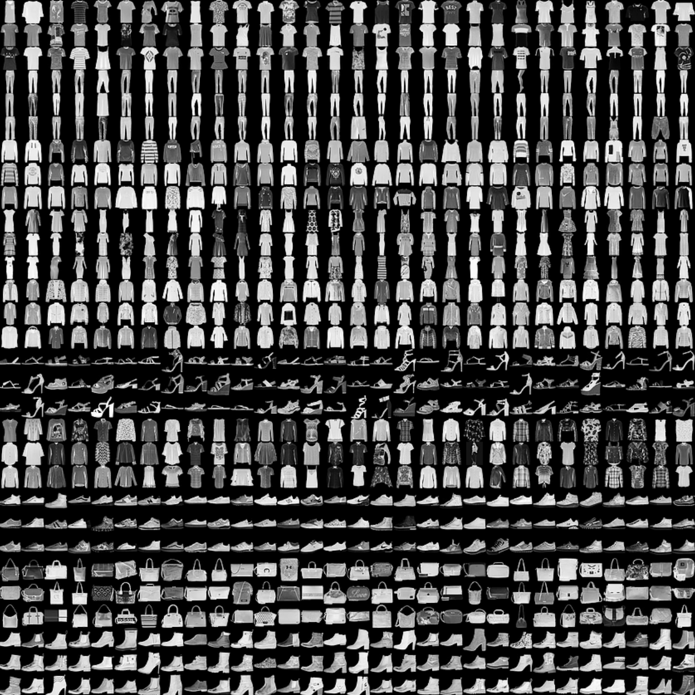
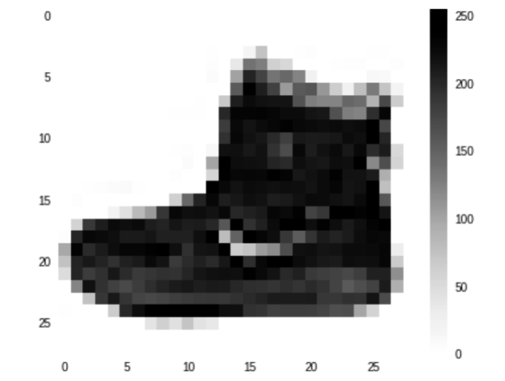
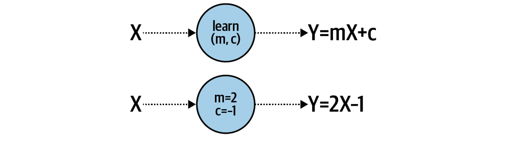
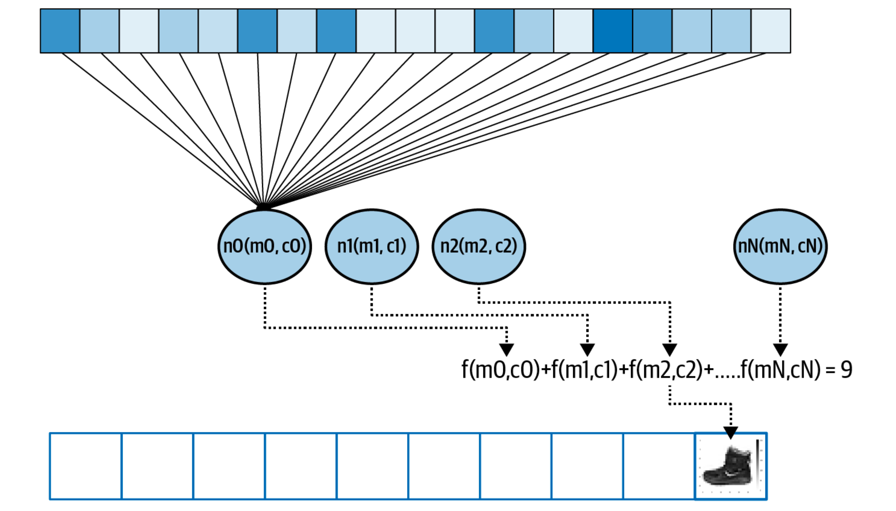
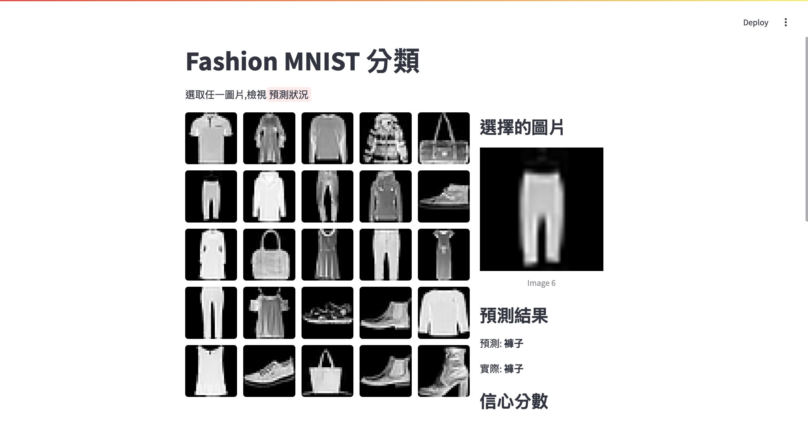

# 電腦視覺(Computer vision)


## 觀念
1. 如何為不曾見過這些物品的人,介紹這些用品.
2. 無法再使用以規則為基礎的機器學習(rules-base)
3. 人類的學習是看大量的圖片,並了解每張圖片是什麼物品,如何使用。
4. 利用電腦視覺來學習大量的圖片

## 資料:
- 使用Fashion MNIST取得大量低解析度圖片
- **有70,000張單色圖片,相同28x28的圖相大小,並且有10種類別**



- **單色圖片是有0-255單色像素所組成,長和寬各28像素**



## 視覺神經元

- 1元1次方程式(Y = 2X + 1),使用一層包含一個核心元的神經網路



- 以先前的經驗`X`,有784個像素(28*28),每個像素有0~255的值,`Y`有0至9,共10個(類型)
- m是權重(weight),c是偏移值(bias)



## 神經網路的設計

```python
model = tf.keras.Sequential([
    tf.keras.layers.Flatten(input_shape=(28, 28)),
    tf.keras.layers.Dense(128, activation='relu'),
    tf.keras.layers.Dense(10, activation='softmax')
    ])
```

### 1. **第1層-輸入層-Flatten**
每張圖片大小為28 x 28,這是2維array,將2維轉換成為1維array

### 2. **第2層-神經元層(Dense)-隱藏層**
- 設定128神經元
- 代表內部當訓練時,有可以暫時儲存的128個參數
- 代表128個神經元會連結前一層的所有神經元

#### 2.1 為何128
- 可以是任意數
- 太多會造成訓練變慢或overfitting
- 太少會造成訓練時沒有足夠的內部參數
- 選擇正確的神經元數量就變為重要,`超參數調整(hyperparameter tuning)`就是在做這一件事情
- 
#### 2.2 激活函式(activation function)
- 是每一個神經元要執行的演算法
- relu(rectified linear unit)
- relu,只有大於0時會傳給下一層


> 整流線性單位函式（Rectified Linear Unit, ReLU），又稱修正線性單元，是一種類神經網路中常用的激勵函式（activation function），通常指代以斜坡函式及其變種為代表的非線性函式。

### 3. **第3層-神經元層(Dense)-輸出層**

- 所有圖片被分為10種類型,所以神經元的數量被設為10
- 每個神經元經由上一層得到了此神經元和上一層輸入像素的匹配的機率
- 透過softmax,最大化這10個神經元中的最大值

#### 3.1 激活函式(activation function)
- softmax

> 使得每一個元素的範圍都在(0,1)之間，並且所有元素的和為1

**使用numpy驗証演算法softmax**

```
import numpy as np
z = np.array([1.0, 2.0, 3.0, 4.0, 1.0, 2.0, 3.0])
softmax = np.exp(z)/sum(np.exp(z))
print(softmax)
print(sum(softmax))
#====結果=====
[0.02364054 0.06426166 0.1746813  0.474833   0.02364054 0.06426166 0.1746813 ]

0.9999999999999999
```

最終,當我們訓練神經網路時,目標是我們可以輸入28 x 28像素陣列,中間層的神經將具有權重和偏差(m和c值),組合後會將這些像素匹配為10個內的其中一個

## 完整的程式碼

```python
import tensorflow as tf
data = tf.keras.datasets.fashion_mnist
(train_images, train_labels), (test_images, test_labels) = data.load_data()
train_images = train_images / 255.0
test_images = test_images / 255.0

model = tf.keras.Sequential([
    tf.keras.layers.Flatten(input_shape=(28, 28)),
    tf.keras.layers.Dense(128, activation='relu'),
    tf.keras.layers.Dense(10, activation='softmax')
    ])

model.compile(optimizer='adam',
              loss='sparse_categorical_crossentropy',
              metrics=['accuracy'])

model.fit(train_images, train_labels, epochs=5)

```

## 程式說明
**取得線上資料module**

```python
data = tf.keras.datasets.fashion_mnist

#====output=====
<module 'keras.api.datasets.fashion_mnist'>
```

**自動切割資料**
- 共有70,000張圖片,70,000個labels
- 自動切割為60,000張訓練圖片,10,000張測試的圖片
- 自動切割為60,000張訓練label,10,000張測試的label

```python
(train_images, train_labels), (test_images, test_labels) = data.load_data()
```

**標準化影像(normalizing)**

- 將像素0-255值,轉換為0~1的數值
- 標準化會增加神經網路訓練的效能
- 無標準化會無法訓練或訓練過程會出現大量的錯誤

```python
train_images = train_images / 255.0
test_images = test_images / 255.0
```

**架構神經網路**

```python
model = tf.keras.Sequential([
    tf.keras.layers.Flatten(input_shape=(28, 28)),
    tf.keras.layers.Dense(128, activation='relu'),
    tf.keras.layers.Dense(10, activation='softmax')
    ])
```

**指定損失函式和優化器**

```python
model.compile(optimizer='adam',
              loss='sparse_categorical_crossentropy',
              metrics=['accuracy'])
```


**開始訓練**

```python

model.fit(train_images, train_labels, epochs=5)

#===output===
Epoch 5/5
1875/1875 ━━━━━━━━━━━━━━━━━━━━ 2s 1ms/step - accuracy: 0.8902 - loss: 0.2929

```

**評估訓練**

```python
model.evaluate(test_images, test_labels)

#====output====
313/313 ━━━━━━━━━━━━━━━━━━━━ 0s 624us/step  accuracy: 0.8721 - loss: 0.3483
[0.35128265619277954, 0.8711000084877014]
```

## 評估預測準確度一般比學習預測準確度`低`
- 在學習的過程中,epochs代表是學習的次數,由於先前的學習過程中,已經有學習過了,
- 在評估的過程中,有些是不曾看過的照片,模型會有的疑惑,所以一般常見評估的準確度會低於學習過程中的準確度
- 例如，如果你從小到大隻見過運動鞋，而這就是你眼中鞋子的樣子，那麼當你第一次看到高跟鞋時，你可能會有點困惑。根據您的經驗，這可能是一隻鞋子，但您不確定。這是一個類似的概念。

**檢示預測結果**

- classification是分類的結果
- 由於測試test_images的shape(10000,28,28),10,000張圖片,每張圖28*28像數
- classification的shape是(10000,10),符合輸出的結果(10個類別)
- classification[0],取得10個值,每一個值就是此類別的概率,可以看到index=9,的概率是10個內最高的8.8601214e-01(88.6%),所以預測是類別9
- test_labels[0]內就是實際類別,也是9

```python
classifications = model.predict(test_images)
print("==test_images.shape======")
print(test_images.shape)
print("=====classifications.shape=======")
print(classifications.shape)
print("===========test_labes.shape========")
print(test_labels.shape)
print("========")
print(classifications[0])
print("========")
print(test_labels[0])

#=====output========

313/313 ━━━━━━━━━━━━━━━━━━━━ 0s 463us/step
==test_images.shape======
(10000, 28, 28)
=====classifications.shape=======
(10000, 10)
===========test_labes.shape========
(10000,)
========
[5.1890393e-06 2.0632758e-08 1.0070431e-06 2.8914906e-07 3.1369641e-06 4.4183522e-03 5.3762105e-05 1.0946561e-01 4.0424326e-05 8.8601214e-01]
========
9
```

## 訓練多趟些(出現過度擬合overfitting)
在這個專案中,我們只訓練了5趟,模型訓練循環5次:隨機初始化神經元,檢查標籤,透過損失函數測量性能,然後5次優化器更新,我們得到的結果是訓練集上的準確率是89%,測試集上的準確率是87%。如果訓練更多趟會發生什麼事?

## 訓練 50 epochs(趟):

- 訓練集最後準確度得到96.3%
- 測試集最後準確度得到87.8%
- 所以訓練集有明確的進步,但測試集只有些微的進步
- 這代表的是過度訓練(過度擬合overfitting)

```
##訓練集
Epoch 49/50

1875/1875 ━━━━━━━━━━━━━━━━━━━━ 3s 1ms/step - accuracy: 0.9624 - loss: 0.0974
Epoch 50/50
1875/1875 ━━━━━━━━━━━━━━━━━━━━ 2s 1ms/step - accuracy: 0.9631 - loss: 0.0995
```

```
##測試集

313/313 ━━━━━━━━━━━━━━━━━━━━ 0s 604us/step - accuracy: 0.8788 - loss: 0.5360
```

## 指定達到特定準確度的訓練

- 使用callback - callback可以在整個訓練中,檢查每一趟的狀態

```
import tensorflow as tf

class myCallback(tf.keras.callbacks.Callback):
    def on_epoch_end(self, epoch, logs={}):
        if(logs.get('accuracy')>0.95):
            print("\n到達95%準確度,停止訓練!")
            print(f"目前訓練至第{epoch}趟")
            self.model.stop_training = True

callbacks = myCallback()
data = tf.keras.datasets.fashion_mnist
(train_images, train_labels), (test_images, test_labels) = data.load_data()
train_images = train_images / 255.0
test_images = test_images / 255.0

model = tf.keras.Sequential([
    tf.keras.layers.Flatten(input_shape=(28, 28)),
    tf.keras.layers.Dense(128, activation='relu'),
    tf.keras.layers.Dense(10, activation='softmax')
    ])

model.compile(optimizer='adam',
              loss='sparse_categorical_crossentropy',
              metrics=['accuracy'])

model.fit(train_images, train_labels, epochs=50,callbacks=callbacks)

#===output===
1848/1875 ━━━━━━━━━━━━━━━━━━━━ 0s 1ms/step - accuracy: 0.9515 - loss: 0.1295
到達95%準確度,停止訓練!
目前訓練至第33趟
1875/1875 ━━━━━━━━━━━━━━━━━━━━ 2s 1ms/step - accuracy: 0.9515 - loss: 0.1296
```

## 轉換為tflite

```python
import tensorflow as tf

def convert_to_tflite(model, output_path='model.tflite'):
    """
    轉換Tensorflow keras model 到 TensorFlow Lite format
    Args:
        model (tf.keras.Model):已經訓練好的模型
        output_path (str):儲存tflite模型的路徑
    """
    #轉換模型
    converter = tf.lite.TFLiteConverter.from_keras_model(model)
    
    #optional:增加最佳化
    converter.optimizations = [tf.lite.Optimize.DEFAULT]

    #轉換模型
    tflite_model = converter.convert()

    #儲存模型成為檔案
    with open(output_path,'wb') as f:
        f.write(tflite_model)
    
    print("儲存模型成功")

class myCallback(tf.keras.callbacks.Callback):
    def on_epoch_end(self, epoch, logs={}):
        if(logs.get('accuracy')>0.95):
            print("\n到達95%準確度,停止訓練!")
            print(f"目前訓練至第{epoch}趟")
            self.model.stop_training = True

callbacks = myCallback()
data = tf.keras.datasets.fashion_mnist
(train_images, train_labels), (test_images, test_labels) = data.load_data()
train_images = train_images / 255.0
test_images = test_images / 255.0

model = tf.keras.Sequential([
    tf.keras.layers.Flatten(input_shape=(28, 28)),
    tf.keras.layers.Dense(128, activation='relu'),
    tf.keras.layers.Dense(10, activation='softmax')
    ])

model.compile(optimizer='adam',
              loss='sparse_categorical_crossentropy',
              metrics=['accuracy'])

model.fit(train_images, train_labels, epochs=50,callbacks=callbacks)
tflite_model_path = 'MNIST_fasion.tflite'
convert_to_tflite(model,tflite_model_path)

```

## 建立streamlit介面

- pip install streamlit
- pip install streamlit-clickable-images



```python
import streamlit as st
from streamlit_clickable_images import clickable_images
import tensorflow as tf
import numpy as np
import matplotlib.pyplot as plt
import io
import base64

# Class names for Fashion MNIST
#class_names = ['T-shirt/top', 'Trouser', 'Pullover', 'Dress', 'Coat',
# 'Sandal', 'Shirt', 'Sneaker', 'Bag', 'Ankle boot']
# Class names for Fashion MNIST
class_names = ['T恤/上衣', '褲子', '毛衣', '連衣裙', '外套',
                '涼鞋', '襯衫', '運動鞋', '包包', 'ankle boot(踝靴)']
def load_and_use_tflite(tflite_model_path:str):
    """
    載入tflite模型和傳出預測function
    Args
        tflite_mode_path(str):模型的路徑
    """
    #載入模型
    interpreter = tf.lite.Interpreter(model_path=tflite_model_path)
    
    #為模型配置記憶體
    interpreter.allocate_tensors()

    #取得輸入和輸出的資訊
    input_details = interpreter.get_input_details()
    output_details = interpreter.get_output_details()

    print(input_details)
    print(output_details)

    #使用tflite模型預測的function
    def predict(input_data):
        #input_data的ndarray的type是int32,轉換型別
        input_data = input_data.astype(np.float32)
        #準備input data
        input_data = input_data.reshape(input_details[0]['shape'])
        
        #將input_tensor指定給模型輸入(使用index編號)
        interpreter.set_tensor(input_details[0]['index'],input_data)
        
        #執行預測
        interpreter.invoke()

        #取得輸出的tensor
        output_data = interpreter.get_tensor(output_details[0]['index'])
        return output_data

    return predict

def convert_image_to_base64(image_array):
    """Convert numpy array to base64 string"""
    plt.figure(figsize=(3, 3))
    plt.imshow(image_array, cmap='gray')
    plt.axis('off')
    
    # Save the plot to a buffer
    buf = io.BytesIO()
    plt.savefig(buf, format='png', bbox_inches='tight', pad_inches=0)
    plt.close()
    
    # Convert to base64
    buf.seek(0)
    image_base64 = base64.b64encode(buf.getvalue()).decode()
    return f"data:image/png;base64,{image_base64}"

def main():
    st.title("Fashion MNIST 分類")
    st.write("選取任一圖片,檢視:red-background[預測狀況]")

    # Load the model
    # model = load_model()
    tflite_path = 'MNIST_fasion.tflite'
    predict = load_and_use_tflite(tflite_path)

    # Load Fashion MNIST dataset
    (_, _), (test_images, test_labels) = tf.keras.datasets.fashion_mnist.load_data()
    
    # Select first 25 test images
    # 隨機選擇25個不重複的索引 (從0到9999)
    # 初始化 session_state 中的隨機索引,因為初始化時只要執行一次
    if 'random_indices' not in st.session_state:
        st.session_state['random_indices'] = np.random.choice(len(test_images), size=25, replace=False)
    

    # 使用這些索引獲取圖片和標籤
    display_images = test_images[st.session_state.random_indices]
    display_labels = test_labels[st.session_state.random_indices]
    
    # Convert images to base64 strings
    image_paths = [convert_image_to_base64(img) for img in display_images]

    # Create columns for layout
    col1, col2 = st.columns([2, 1])

    with col1:
        # Display clickable image grid
        clicked = clickable_images(
            image_paths,
            titles=[f"Image {i+1}" for i in range(len(image_paths))],
            div_style={"display": "grid", "grid-template-columns": "repeat(5, 1fr)", "gap": "10px"},
            img_style={"cursor": "pointer", "border-radius": "5px", 
                      "transition": "transform 0.3s", "width": "100%"}
        )

    # Display prediction in the second column
    with col2:
        if clicked > -1:  # If an image was clicked
            st.write("### 選擇的圖片")
            selected_image = display_images[clicked]
            st.image(selected_image, caption=f'Image {clicked + 1}', width=200)
            
            # Preprocess and predict
            processed_image = selected_image / 255.0
            prediction = predict(processed_image)
            predicted_class = np.argmax(prediction)
            actual_class = display_labels[clicked]
            
            st.write("### 預測結果")
            st.write(f"預測: **{class_names[predicted_class]}**")
            st.write(f"實際: **{class_names[actual_class]}**")
            
            # Show prediction probabilities
            st.write("### 信心分數")
            for i, prob in enumerate(prediction[0]):
                st.progress(float(prob))
                st.write(f"{class_names[i]}: {prob*100:.1f}%")

if __name__ == '__main__':
    main()
```


