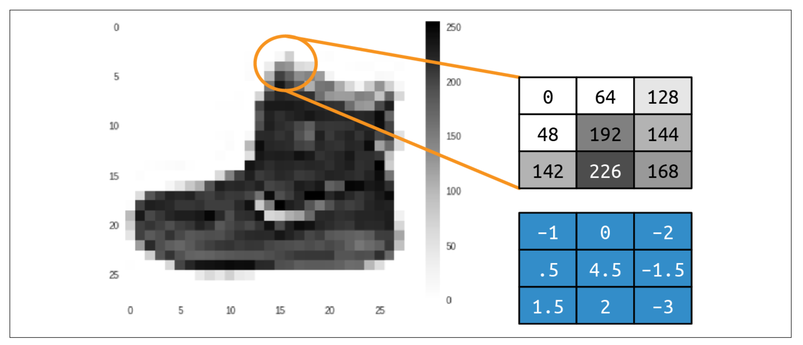
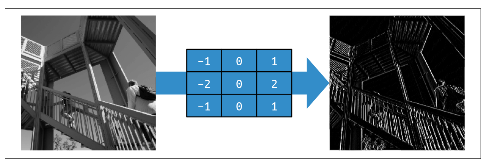
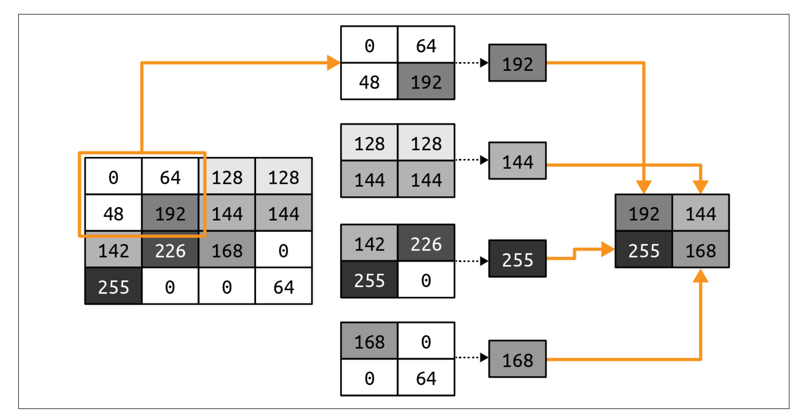
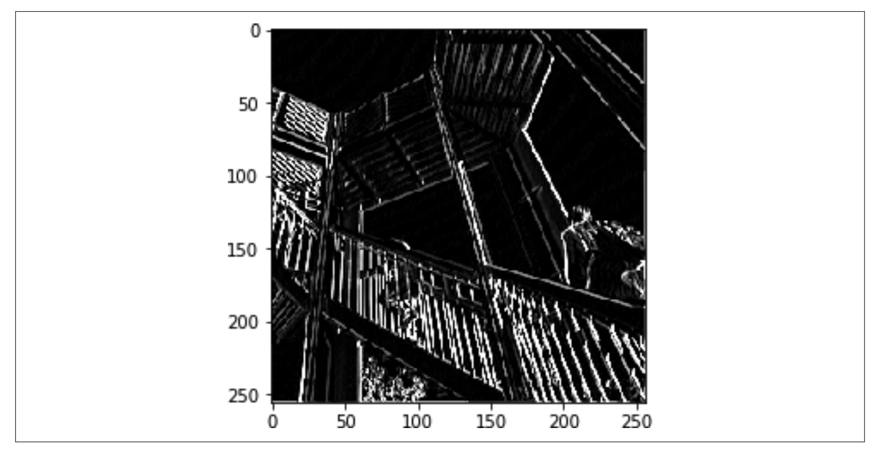
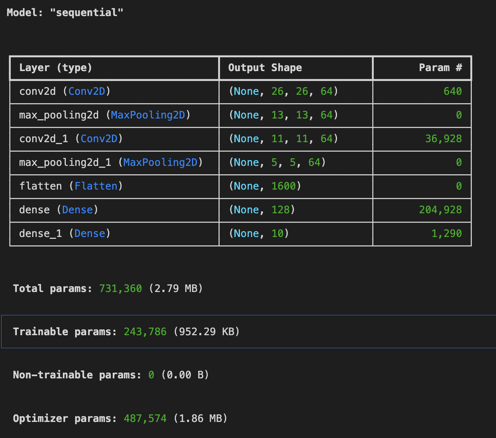
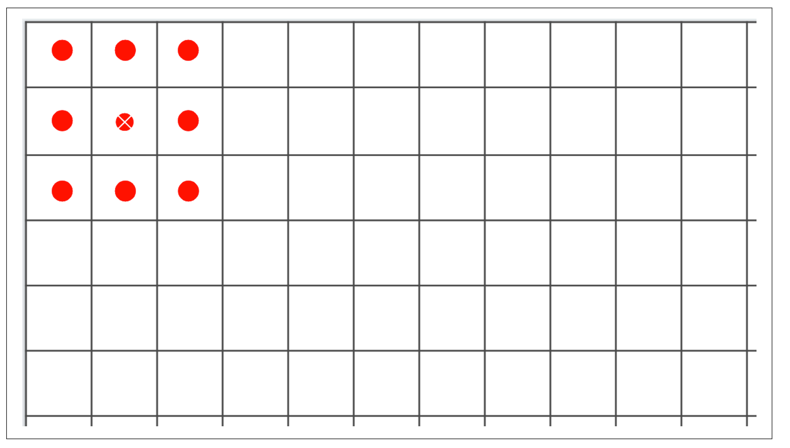

# 檢測影像中的特徵
MNIST Fashion的範例,是多張小的單色圖片,每個項目都在圖片正中央。上面是學習像素的資訊,這是有明顯缺點。

這一篇將著重於,學習圖片的`特徵`,並且學習特徵。重點在於把像素的資訊過濾成為特徵組成的元素(特徵元素),匹配特徵元素比匹配像素,將會得到更好的效果。

比如說鞋底,有一大群黑色的像素有底下,讓神經網路觀注於下面有一群黑色像素就是鞋子，如果鞋子不在正中間,有一些偏移,則預測就會有問題。

有一種過濾特徵的方式,照片透過影像處理方式,例如在照片上使用photoshop的濾鏡功能，讓圖片呈現出特徵.如果在神經網路上使用這一個方式稱為卷積神經網路convolution neural network(CNN).

- 增加影像特徵(augmentation of image)
- 遷移學習(transfer learning) - 取得別人先前訓練的特徵
- dorpout - 優化模型

## 卷積(Convolutions)
卷積只是一個權重過濾器，用於將像素與其鄰居相乘以獲得該像素的新值。
如下9宮格所示,要計算192像素那一格,賦予一個過濾器,得到一個全新的值:



new_val = (-1 * 0) + (0 * 64) + (-2 * 128) +
(.5 * 48) + (4.5 * 192) + (-1.5 * 144) +
(1.5 * 142) + (2 * 226) + (-3 * 168)

new_val = 577

- **使用過濾器移除512*512像素內除了直線以外的的資訊**



- **使用過濾器移除512*512像素內除了 水平線以外的的資訊**


Pooling
- 重新計算各像素,減少像素的總數量,下方的計算是取4個像素,然後採用4個像素中的最大值。



- 以下圖片是使用垂直過濾和max pooling
- 總像素從512*512變為256*256,總像素減少75%。




## 使用卷積建構模型:

```python
import tensorflow as tf
data = tf.keras.datasets.fashion_mnist

(training_images, training_labels), (test_images, test_labels) = data.load_data()
# 先改變training_images和traingin_labels的維度
# training_images.shape -> (60000,28,28)
training_images = training_images.reshape(60000,28,28,1)
training_images = training_images / 255.0
test_images = test_images.reshape(10000, 28, 28, 1)
test_images = test_images / 255.0

model = tf.keras.models.Sequential([
    tf.keras.layers.Conv2D(64,(3,3),
                           activation='relu',
                           input_shape=(28, 28, 1)),
    tf.keras.layers.MaxPooling2D(2,2),
    tf.keras.layers.Conv2D(64,(3,3),activation='relu'),
    tf.keras.layers.MaxPooling2D(2,2),
    tf.keras.layers.Flatten(),
    tf.keras.layers.Dense(128, activation=tf.nn.relu),
    tf.keras.layers.Dense(10, activation=tf.nn.softmax)
])

model.compile(optimizer='adam',
              loss='sparse_categorical_crossentropy',
              metrics=['accuracy'])

model.fit(training_images, training_labels, epochs=50)
model.evaluate(test_images, test_labels)

#====output====
1875/1875 ━━━━━━━━━━━━━━━━━━━━ 11s 6ms/step - accuracy: 0.9945 - loss: 0.0187
Epoch 50/50
1875/1875 ━━━━━━━━━━━━━━━━━━━━ 11s 6ms/step - accuracy: 0.9964 - loss: 0.0123
313/313 ━━━━━━━━━━━━━━━━━━━━ 1s 2ms/step - accuracy: 0.9099 - loss: 0.8568

-------
[0.841273844242096, 0.9142000079154968]
```

## 檢測模型

```python
model.summary()
```



- **第1行output shape(26x26x64)**

	26的原因是套用過濾器時,使用3*3,圖片4周的1像素會被丟棄,如果使用5x5過濾器4周的2個像素會被丟棄,就成為24x24.如下圖所視
	


- **第2行的pooling層**

	由於使用(2x2),所以該層會變為(13x13)
	
- **第3行的卷積層**

一樣使用(3x3)過濾器,變為(11x11)

- **第4行的pooling層**

使用(2x2),所以該層會變為(5x5)

