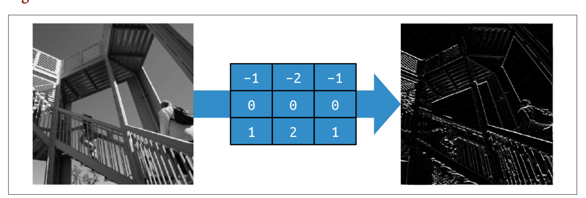

# 檢測影像中的特徵
MNIST Fashion的範例,是多張小的單色圖片,每個項目都在圖片正中央。上面是學習像素的資訊,這是有明顯缺點。

這一篇將著重於,學習圖片的`特徵`,並且學習特徵。重點在於把像素的資訊過濾成為特徵組成的元素(特徵元素),匹配特徵元素比匹配像素,將會得到更好的效果。

比如說鞋底,有一大群黑色的像素有底下,讓神經網路觀注於下面有一群黑色像素就是鞋子，如果鞋子不在正中間,有一些偏移,則預測就會有問題。

有一種過濾特徵的方式,照片透過影像處理方式,例如在照片上使用photoshop的濾鏡功能，讓圖片呈現出特徵.如果在神經網路上使用這一個方式稱為卷積神經網路convolution neural network(CNN).

- 增加影像特徵(augmentation of image)
- 遷移學習(transfer learning) - 取得別人先前訓練的特徵
- dorpout - 優化模型

## 卷積(Convolutions)
卷積只是一個權重過濾器，用於將像素與其鄰居相乘以獲得該像素的新值。
如下9宮格所示,要計算192像素那一格,賦予一個過濾器,得到一個全新的值:

new_val = (-1 * 0) + (0 * 64) + (-2 * 128) +
(.5 * 48) + (4.5 * 192) + (-1.5 * 144) +
(1.5 * 142) + (2 * 226) + (-3 * 168)

new_val = 577

- **使用過濾器移除512*512像素內除了直線以外的的資訊**

- **使用過濾器移除512*512像素內除了 水平線以外的的資訊**

Pooling
- 重新計算各像素,減少像素的總數量,下方的計算是取4個像素,然後採用4個像素中的最大值。

- 以下圖片是使用垂直過濾和max pooling
- 總像素從512*512變為256*256,總像素減少75%。

