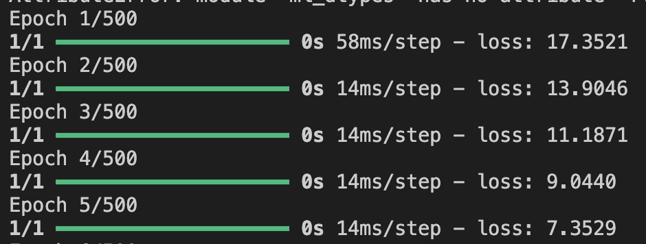
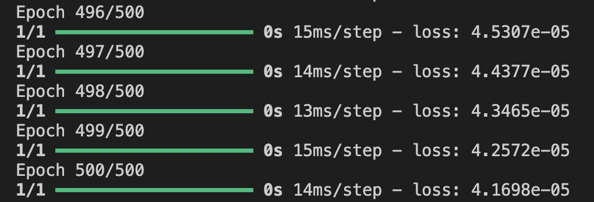
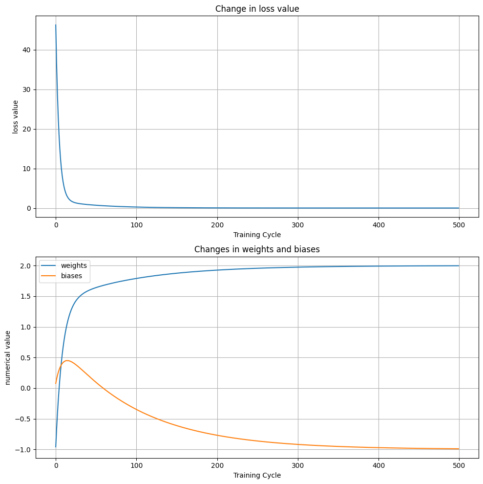

## **建立模型和訓練模式(created_model)**
- 儲存為tflite
- Y=2X-1(一元一次方程式)

#### NumPy 陣列轉換與模型訓練說明

這段程式碼展示了機器學習模型訓練和轉換的關鍵步驟，讓我們逐步解析：

**資料準備**

```
x = [-1, 0, 1, 2, 3, 4] #輸入資料x
y = [-3, -1, 1, 3, 5, 7] #目標資料y
```

**轉換為 NumPy 陣列：**
 
```python
xs = np.array(x, dtype=float)
ys = np.array(y, dtype=float)

# 這個轉換很重要，因為：
# TensorFlow 需要 NumPy 陣列格式的數據
# dtype=float 確保數據型別為浮點數，避免精度問題 
# 統一的數據格式有助於提高計算效率
```


#### 模型訓練

```python
model.fit(xs, ys, epochs=500) 

#fit()方法是 TensorFlow 中啟動訓練的標準方式
#epochs=500 表示模型將重覆訓練 500 次
#訓練過程中模型會不斷調整權重以最小化損失函數
```


#### 觀察權重和損失函數
前5筆損失函數


最後5筆損失函數


**取得最後權重(weight)和最後偏差值(bias)**

```python
import tensorflow as tf
import numpy as np

l0 = tf.keras.layers.Dense(units=1, input_shape=[1])
model = tf.keras.Sequential([l0])
model.compile(optimizer='sgd', loss='mean_squared_error')

x = [-1, 0, 1, 2, 3, 4]
y = [-3, -1, 1, 3, 5, 7]
xs = np.array(x, dtype=float)
ys = np.array(y, dtype=float)

model.fit(xs, ys, epochs=500)

print(model.predict(np.array([10.0])))
print("權重:", l0.get_weights()[0], "偏差:", l0.get_weights()[1])

#=====output======
[[18.9838]]
權重: [[1.9976522]] 偏差: [-0.9927207]
```

#### 評估模型(evaluation_models.ipynb)
##### 計畫步驟：

1. 建立callback函數來收集訓練過程的權重和損失值
2. 修改訓練過程以使用callback函數
3. 使用matplotlib繪製訓練過程的圖表
   - 繪製損失值變化
   - 繪製權重變化
4. 圖表展示在不同的子圖中

```python
import tensorflow as tf
import numpy as np
import matplotlib.pyplot as plt

# 定義callback類別來收集訓練數據
class TrainingCallback(tf.keras.callbacks.Callback):
    def __init__(self):
        self.weights = []
        self.biases = []
        self.losses = []
    
    def on_epoch_end(self, epoch, logs=None):
        self.weights.append(self.model.layers[0].get_weights()[0][0][0])
        self.biases.append(self.model.layers[0].get_weights()[1][0])
        self.losses.append(logs['loss'])

# 建立模型
l0 = tf.keras.layers.Dense(units=1, input_shape=[1])
model = tf.keras.Sequential([l0])
model.compile(optimizer='sgd', loss='mean_squared_error')

# 準備訓練資料
x = [-1, 0, 1, 2, 3, 4]
y = [-3, -1, 1, 3, 5, 7]
xs = np.array(x, dtype=float)
ys = np.array(y, dtype=float)

# 建立回調實例
callback = TrainingCallback()

# 訓練模型
history = model.fit(xs, ys, epochs=500, callbacks=[callback])

# 創建圖表
fig, (ax1, ax2) = plt.subplots(2, 1, figsize=(10, 10))

# 繪製損失值變化
ax1.plot(callback.losses)
ax1.set_title('Change in loss value')# 損失值變化
ax1.set_xlabel('Training Cycle') # 訓練週期
ax1.set_ylabel('loss value') # 損失值
ax1.grid(True)

# 繪製權重和偏差變化
ax2.plot(callback.weights, label='weights')
ax2.plot(callback.biases, label='biases')
ax2.set_title('Changes in weights and biases') # 權重和偏差變化
ax2.set_xlabel('Training Cycle') # 訓練週期
ax2.set_ylabel('numerical value') # 數值
ax2.legend()
ax2.grid(True)

plt.tight_layout()
plt.show()

# 輸出最終結果
print("預測值:", model.predict(np.array([10.0])))
print("最終權重:", l0.get_weights()[0])
print("最終偏差:", l0.get_weights()[1])

#====output====
預測值: [[18.976908]]
最終權重: [[1.9966532]]
最終偏差: [-0.989624]
```



#### 將模型轉換為TFLite 
最後，將訓練好的模型轉換為 TFLite 格式：
- TFLite 是專為移動和嵌入式設備優化的格式
- 轉換後的模型體積更小，運行更快
- 儲存為 `.tflite` 檔案方便部署到其他平台

```python
def convert_to_tflite(model, output_path='model.tflite'):
    """
    轉換TensorFlow Keras model 成為Tensorflow lite 格式
    參數:
        model (tf.keras.Model):訓練完成的keras model
        output_path (str): 要儲存為tensorflow lite格式的路徑和檔案名稱(tflite)    
    Returns:
        None
    """
    # 建立converter
    converter = tf.lite.TFLiteConverter.from_keras_model(model)
    
    # Optional: Add optimization techniques
    converter.optimizations = [tf.lite.Optimize.DEFAULT]
    
    # Convert the model
    tflite_model = converter.convert()
    
    # Save the model to disk
    with open(output_path, 'wb') as f:
        f.write(tflite_model)
    
    print(f"TFLite model saved to {output_path}")
tflite_model_path = 'linear_model.tflite'
convert_to_tflite(model, tflite_model_path)


```


#### 最終訓練,儲存為linear_model.tflite

```python
import tensorflow as tf
import numpy as np

# Convert the model to TensorFlow Lite
def convert_to_tflite(model, output_path='model.tflite'):
    """
    Convert a TensorFlow Keras model to TensorFlow Lite format
    
    Args:
        model (tf.keras.Model): The trained Keras model
        output_path (str): Path to save the converted TFLite model
    
    Returns:
        bytes: TFLite model in byte format
    """
    # Convert the model
    converter = tf.lite.TFLiteConverter.from_keras_model(model)
    
    # Optional: Add optimization techniques
    converter.optimizations = [tf.lite.Optimize.DEFAULT]
    
    # Convert the model
    tflite_model = converter.convert()
    
    # Save the model to disk
    with open(output_path, 'wb') as f:
        f.write(tflite_model)
    
    print(f"TFLite model saved to {output_path}")

   

# Original model training
model = tf.keras.Sequential([
    tf.keras.layers.Dense(units=1, input_shape=[1])
])
model.compile(optimizer='sgd', loss='mean_squared_error')

x = [-1, 0, 1, 2, 3, 4]
y = [-3, -1, 1, 3, 5, 7]
xs = np.array(x, dtype=float)
ys = np.array(y, dtype=float)

model.fit(xs, ys, epochs=500)

# Convert the model to TFLite
tflite_model_path = 'linear_model.tflite'
convert_to_tflite(model, tflite_model_path)
```


- **使用模型(using_model)**
1. 建立TFLite interpreter(解譯器)
	- 解釋器負責載入和執行模型

2. 分配tensor(張量)需要的記憶體
	- allocate_tensors() 為模型的所有張量分配記憶體空間
	- 這是在使用模型進行預測前的必要步驟
	- 確保模型有足夠的記憶體來存儲計算過程中的中間結果

```python
# Load the TFLite model
interpreter = tf.lite.Interpreter(model_path=tflite_model_path)
interpreter.allocate_tensors()
```

3. **獲取模型的輸入和輸出張量的詳細資訊**
- input_details和output_details相關資訊,包括:
	- 張量名稱(name)
	- 張量索引(index)
	- 張量形狀(shape)
	- 數據類型(dtype)
	- 量化參數(如果有的話)
- 檢查詳細資訊
	- 使用print直接查看

```python
import tensorflow as tf
# Load the TFLite model
interpreter = tf.lite.Interpreter(model_path='linear_model.tflite')
interpreter.allocate_tensors()
input_details = interpreter.get_input_details()
output_details = interpreter.get_output_details()
print("輸入張量詳情:")
print(input_details)
print("\n輸出張量詳情:")
print(output_details)

#====output====
輸入張量詳情:
[{'name': 'serving_default_keras_tensor:0', 'index': 0, 'shape': array([1, 1], dtype=int32), 'shape_signature': array([-1,  1], dtype=int32), 'dtype': <class 'numpy.float32'>, 'quantization': (0.0, 0), 'quantization_parameters': {'scales': array([], dtype=float32), 'zero_points': array([], dtype=int32), 'quantized_dimension': 0}, 'sparsity_parameters': {}}]

輸出張量詳情:
[{'name': 'StatefulPartitionedCall_1:0', 'index': 3, 'shape': array([1, 1], dtype=int32), 'shape_signature': array([-1,  1], dtype=int32), 'dtype': <class 'numpy.float32'>, 'quantization': (0.0, 0), 'quantization_parameters': {'scales': array([], dtype=float32), 'zero_points': array([], dtype=int32), 'quantized_dimension': 0}, 'sparsity_parameters': {}}]
```
- 
	- 查看特定屬性

```python
import tensorflow as tf
# Load the TFLite model
interpreter = tf.lite.Interpreter(model_path='linear_model.tflite')
interpreter.allocate_tensors()
input_details = interpreter.get_input_details()
output_details = interpreter.get_output_details()
# 檢查輸入張量的形狀和類型
print("輸入張量形狀:", input_details[0]['shape'])
print("輸入張量類型:", input_details[0]['dtype'])

# 檢查輸出張量的形狀和類型
print("輸出張量形狀:", output_details[0]['shape'])
print("輸出張量類型:", output_details[0]['dtype'])

#====output====
輸入張量形狀: [1 1]
輸入張量類型: <class 'numpy.float32'>
輸出張量形狀: [1 1]
輸出張量類型: <class 'numpy.float32'>
```

4. 轉換資料成為符合input_details內'shape'所符合的資料

```python
import tensorflow as tf
import numpy as np
interpreter = tf.lite.Interpreter(model_path='linear_model.tflite')
interpreter.allocate_tensors()
input_details = interpreter.get_input_details()
output_details = interpreter.get_output_details()
# 檢視轉換過程
input_value = [1.0]
print("原始輸入:", input_value)
print("形狀:", input_details[0]['shape'])
converted = np.array(input_value, dtype=np.float32)
print("轉換後:", converted)
reshaped = converted.reshape(input_details[0]['shape'])
print("重塑後:", reshaped)

#===output===
原始輸入: [1.0]
形狀: [1 1]
轉換後: [1.]
重塑後: [[1.]]
```

5. 設定interpreter輸入的張量
	- set_tensor() 將準備好的輸入數據分配給模型
	- input_details[0]['index'] 指定輸入張量的位置

```python
interpreter.set_tensor(input_details[0]['index'], input_data)
```

6. 模型執行推論
- invoke() 觸發模型執行推論計算
- 使用已設置的輸入數據進行運算
- 計算結果存儲在輸出張量中

```python
interpreter.invoke()
```

7. 取出輸出的張量

```python
output_data = interpreter.get_tensor(output_details[0]['index'])
```

**完整的程式碼**

```python
import tensorflow as tf
import numpy as np

def load_and_use_tflite(tflite_model_path):
    """
    Load a TensorFlow Lite model and use it for prediction
    
    Args:
        tflite_model_path (str): Path to the .tflite model file
    
    Returns:
        TFLite Interpreter
    """
    # Load the TFLite model
    interpreter = tf.lite.Interpreter(model_path=tflite_model_path)
    interpreter.allocate_tensors()
    
    # Get input and output tensors
    input_details = interpreter.get_input_details()
    output_details = interpreter.get_output_details()
    
    # Function to predict using the TFLite model
    def predict(input_data):
        # Prepare input data
        input_data = np.array(input_data, dtype=np.float32).reshape(input_details[0]['shape'])
        
        # Set the tensor to point to the input data to be inferred
        interpreter.set_tensor(input_details[0]['index'], input_data)
        
        # Run inference
        interpreter.invoke()
        
        # Get the output tensor
        output_data = interpreter.get_tensor(output_details[0]['index'])
        
        return output_data
    
    return predict

tflite_model_path = 'linear_model.tflite'
# Load the TFLite model
tflite_predict = load_and_use_tflite(tflite_model_path)
# Make predictions
test_input = [10.0]
print("TFLite Model Prediction:", tflite_predict(test_input))
```

**為什麼使用內部函式**

1. 封裝性
	- 內部函數可以讀取外部函數的變數（closure）
	- 可以直接使用外部函式的變數如interpreter, input_details和output_details
	- 避免這些變數被全域污染

2. 狀態保持
 - interpreter 的狀態被保持在closure中
 - 不需要每次預測時重新載入模型
 - 提高執行效率

3. 介面簡化
- 使用者只需要關注輸入數據
- 複雜的模型操作被隱藏在內部

4. 記憶體效率
- 模型只需要載入一次
- 避免重複分配記憶體
- 特別適合需要多次預測的場景

5. 最佳實踐
**這種設計模式(Factory Pattern)特別適合**
- 需要初始化複雜對象
- 需要保持狀態
- 希望提供簡單介面
- 需要封狀實作細節


